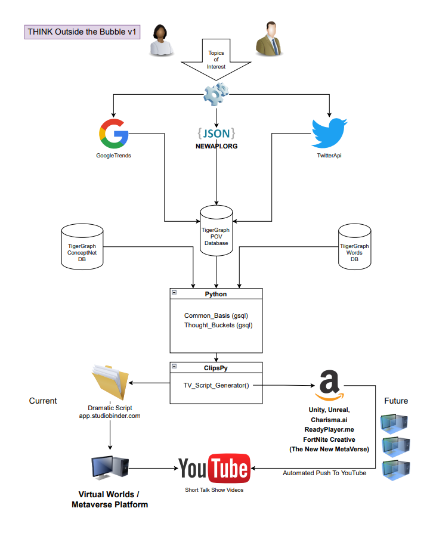

# THINK Outside the Bubble!

**Problem Statement**:

Foster critical thinking through an innovative use of Virtual Humans, as Talk Show hosts; that introduce people to ideas both inside and outside of their filter bubbles, in a fun and entertaining way.

**Description**: 

Virtual Influencers and Virtual Humans have exploded across the internet and real world in the last year.  There has been an explosive growth in  virtual digital people.  The traditional TV industry has entered the field of virtual idols.  See the Forbes article on [AI Generated Characters](https://www.forbes.com/sites/traceyfollows/2022/04/15/ai-generated-characters-are-here-theyre-just-not-evenly-distributed/).  They report on an event to demonstrate the myriad opportunities for the use of virtual characters in positive ways. There has been much media coverage on AI-generated characters resulting in deep fakes or voice fakes being harmful. 

Our virtual talk show host will engage multiple audiences in a fun and entertaining way.  Providing many points-of-view (POVs) for each of the show's topics.  The virtual host has minimal real world baggage and can present the information as bias-free as possible.  When it comes to core competencies, the key to the virtual digital human is that the more personable the better, the closer the human design is to a real idol, the better.   As the TV talk show host matures; entire story teams will be needed to help create more realistic shows.  Two early tools are from [CorridorDigital](https://www.corridordigital.com/), creating AI Virtual Influencers; and [Charisma.ai](https://charisma.ai/), enabling Real Time Digital Humans. Both provide no code visual story design.

Engagement is still similar to real influencers; it will require outstanding design work, distinctive and penetrating characters, and in-depth interaction with fans.   Success is determined by having entertaining and yet educational content; automatically created using tools such as TigerGraph, that can extract relationships from data.

## Dependencies

> Prerequisites: 
  Before, getting started install the following,
  - Python 3 => https://docs.python-guide.org/starting/install3/osx/
  - Jupyter notebook/ MS Visual Studio Code => https://jupyter.org/install
  - Create tgcloud solution => https://www.tigergraph.com/blog/taking-your-first-steps-in-learning-tigergraph-cloud/
    - keep the solution url, username, password handy to plug-in to the backend APIs.

## Installation

1. Clone repository
2. Review this [Blog](https://medium.com/@sudha.vijayakumar_74093/a-common-sense-word-network-with-tigergraph-573745e4504d)
3. Install dependencies (pip install TigerGraph)

## Running

 All the real work is done in src/ThinkOTB.ipynb

## System Diagram

## Known Issues and Future Improvements

The POV List still requires human validation and correction. 

## Reflections

It got complicated quickly.  And there were actually too many Metaverses to choose from.

## References

Please Read [Sudha's Blog](https://medium.com/@sudha.vijayakumar_74093/a-common-sense-word-network-with-tigergraph-573745e4504d) without it this would have taken a whole lot longer.
